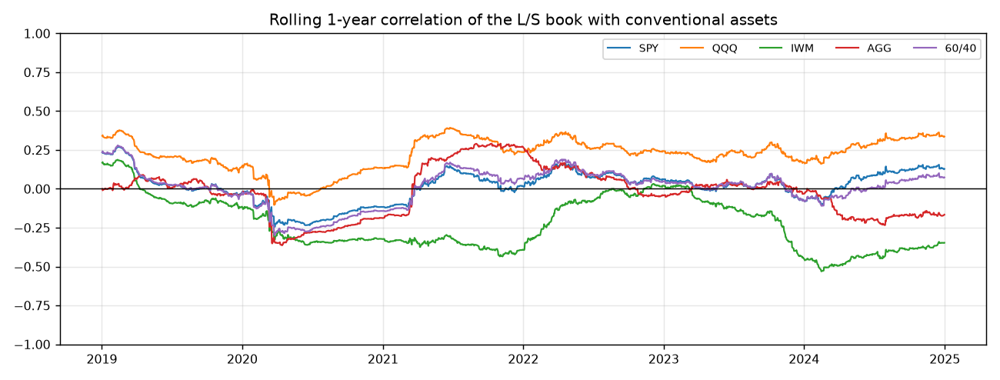
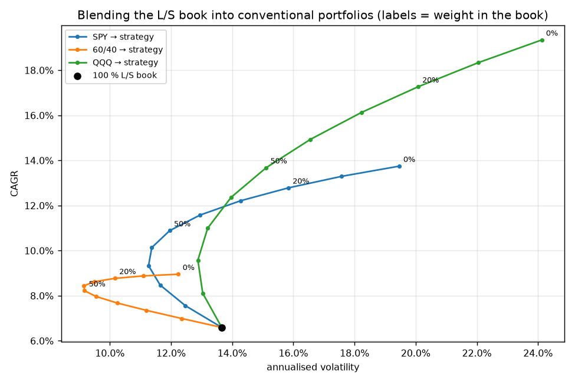
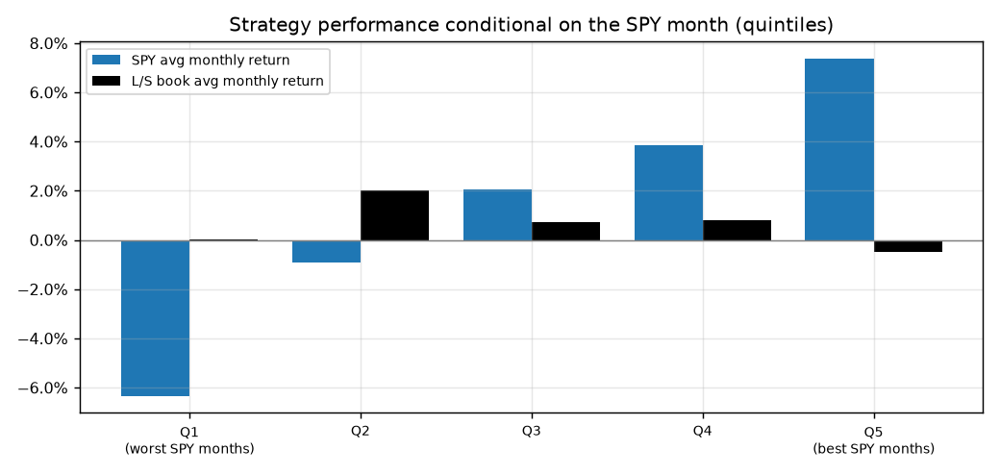
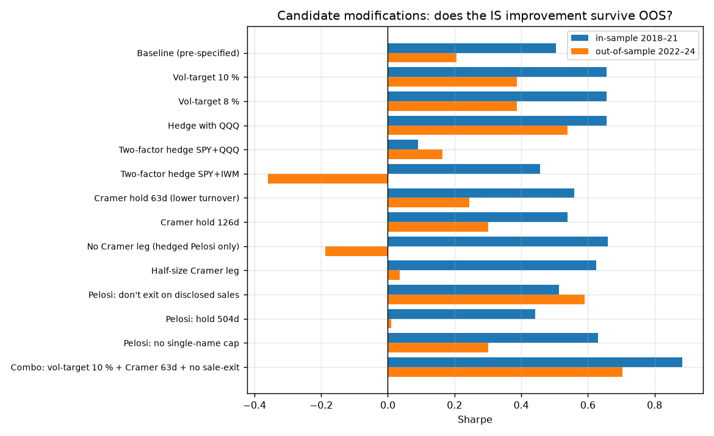
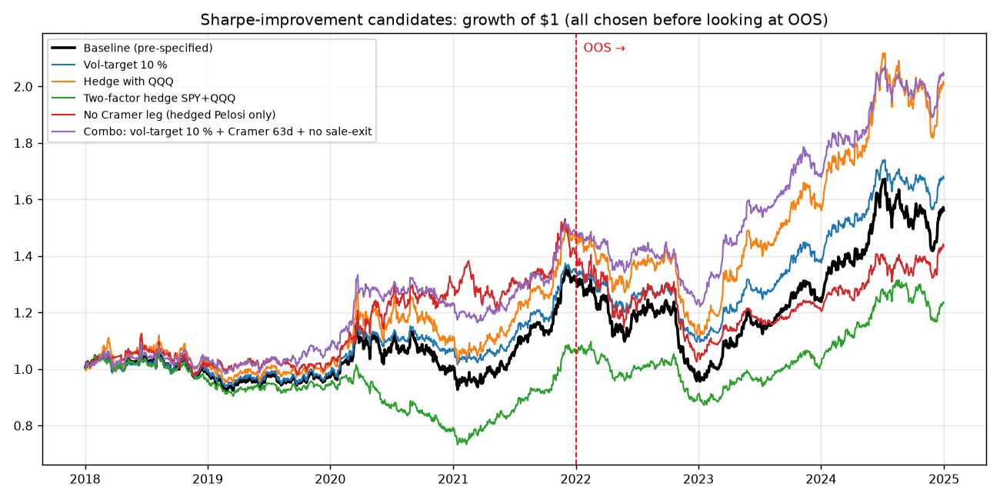

# Diversification value and Sharpe-improvement analysis

Companion to `report.md`. Same book (long Pelosi / short Cramer, beta-hedged with SPY, pre-specified parameters, net of costs), same joint window 2018-01-02 → 2024-12-31; IS = 2018–2021, OOS = 2022–2024.

## Key findings

* **The book is uncorrelated with everything conventional.** Daily correlation with SPY +0.01, with a 60/40 portfolio +0.00, with bonds (AGG) -0.06, long Treasuries (TLT) +0.00, gold -0.07. Monthly correlations are similar (SPY -0.09). The rolling 1-year correlation with SPY stays within [-0.24, +0.27]. The only non-trivial loadings are +0.22 to QQQ and -0.22 to IWM: the large-cap-growth residual.
* **Diversification benefit is real but small, because the book's own Sharpe is small.** Moving 20 % of a 60/40 portfolio into the book changes Sharpe 0.57 → 0.65, max drawdown -21.7% → -18.6%, CAGR 9.0% → 8.8%. For SPY: Sharpe 0.64 → 0.69, max drawdown -33.7% → -25.8%, CAGR 13.7% → 12.8%. Run as an overlay (keep the 60/40, add 25–50 % of the book on top) the Sharpe goes 0.57 → 0.65–0.68 with CAGR 9.0% → 10.3%–11.5%. Block-bootstrap 95 % CI on the Sharpe gain from a 20 % funded allocation out of 60/40: [-0.16, +0.29], P(gain ≤ 0) = 0.28. Zero correlation is necessary but not sufficient: a Sharpe-0.37 diversifier can only lift a Sharpe-0.57 portfolio by a few hundredths.
* **The IS-chosen allocation survives OOS, weakly.** The weight that maximised the 60/40 blend's IS Sharpe (35% in the book), held through 2022–24, gives Sharpe 0.11 → 0.20 and max drawdown -20.3% → -19.7%, in a period in which the book itself had Sharpe 0.21. For SPY the IS weight is 50% and OOS Sharpe goes 0.35 → 0.39.
* **Mildly counter-cyclical in fast crashes, not in a slow growth bear.** In SPY down months the book averaged 1.0% per month (hit rate 60.7%) against 0.5% in up months, and it lost money on average in the best SPY quintile (-0.5%). It made 12.5% through the COVID crash (Cramer's names fell harder than Pelosi's), 5.2% through the regional-bank stress and 0.8% in Q4-2018 — but -8.8% across the 2022 bear market, because its residual exposure is long mega-cap growth and that is what de-rated. It diversifies; it is not a tail hedge.
* **Inside the book, the two legs diversify each other** (daily correlation of the two hedged legs -0.23), so the combination (Sharpe 0.37) beats either leg alone (Pelosi 0.29, Cramer 0.12) even though the Cramer leg is near break-even after costs. The short-notional sweep is a textbook overfitting warning: in-sample the best ratio is 0.00× short per unit long (i.e. drop the Cramer leg, IS Sharpe 0.66) — and that choice has the *worst* OOS Sharpe of the sweep (-0.19). OOS Sharpe rises monotonically with the short weight (best at 2.00×, 0.33), because the Cramer leg is what carried 2022. The pre-specified 1:1 is a sensible middle.
* **Sharpe improvers, tested IS → OOS.** 8 of 13 pre-declared changes beat the baseline (IS 0.50 / OOS 0.21) in *both* halves. They fall into three groups. (i) **Volatility targeting** (10 %: IS 0.66, OOS 0.39, max drawdown -20.3% vs -29.6%) — the change that requires no view about the signals, is standard for a neutral book, and works by de-levering in 2020 and 2022 (average leverage 0.80×). (ii) **A slower Cramer leg** (63d/126d holds: OOS 0.25/0.30), which halves turnover; the IS grid in `report.md` had already pointed here. (iii) **More Pelosi concentration** (no exit on disclosed sales OOS 0.59, no single-name cap OOS 0.30) — real improvements in this sample, but each is a larger bet on NVDA/AAPL/MSFT in 2023–24 rather than new evidence of information. The pre-declared combo of (i)+(ii)+no-sale-exit reaches IS 0.88, OOS 0.70, full 0.81, max drawdown -19.7%.
* **The growth tilt *is* the return.** A two-factor SPY+QQQ hedge that drives realised QQQ beta to -0.01 leaves a Sharpe of 0.12 (IS 0.09, OOS 0.16); hedging size as well (SPY+IWM) gives 0.09. Hedging with QQQ *instead of* SPY does the opposite — Sharpe 0.61, better in both halves and in every calendar year — but it does not remove the QQQ beta (+0.13, same as baseline). It works because the overlay is on average net *long* the index (mean hedge +0.13 of NAV: the Pelosi leg averages only 0.74 gross while the short leg is 1.00 with a higher estimated beta), so replacing SPY by QQQ adds a long QQQ-minus-SPY position, and in 2022 the overlay happened to be short when QQQ fell more. That is a growth bet layered on a growth bet, not a better hedge. Once mega-cap-growth exposure is neutralised there is little idiosyncratic Pelosi/Cramer alpha left to diversify anything with.

## 1. Correlation with conventional assets

Daily and monthly return correlations over the joint window. `60/40` = daily-rebalanced 60 % SPY / 40 % AGG.

| asset | corr_daily | corr_monthly |
|---|---|---|
| SPY (S&P 500) | 0.013 | -0.094 |
| IWM (Russell 2000) | -0.220 | -0.349 |
| QQQ (Nasdaq 100) | 0.220 | 0.146 |
| DIA (Dow Jones Industrial) | -0.119 | -0.278 |
| RSP (S&P 500 Equal Weight) | -0.195 | -0.325 |
| VTI (US Total Market) | -0.017 | -0.130 |
| AGG (US Aggregate Bonds) | -0.059 | -0.063 |
| TLT (20y+ Treasuries) | 0.001 | 0.054 |
| GLD (Gold) | -0.072 | 0.056 |
| 60/40 (SPY/AGG blend) | 0.000 | -0.095 |

The rolling correlation with SPY oscillates around zero with no trend; the ex-ante hedge does what it is meant to. Correlation with QQQ is mildly positive and with IWM mildly negative, the signature of the large-cap-growth residual documented in `report.md`.

## 2. Blending the book into a conventional portfolio

### 2a. Funded allocation (sell the base portfolio to buy the book)

**Base = SPY**

| weight in book | cagr | vol | sharpe | max_dd | worst_month | beta_spy |
|---|---|---|---|---|---|---|
| 0% | 13.7% | 19.5% | 0.64 | -33.7% | -12.5% | 1.00 |
| 10% | 13.3% | 17.6% | 0.67 | -29.8% | -10.4% | 0.90 |
| 20% | 12.8% | 15.8% | 0.69 | -25.8% | -8.6% | 0.80 |
| 30% | 12.2% | 14.3% | 0.72 | -21.5% | -8.6% | 0.70 |
| 40% | 11.6% | 13.0% | 0.73 | -22.1% | -8.5% | 0.60 |
| 50% | 10.9% | 12.0% | 0.73 | -22.9% | -8.5% | 0.50 |
| 75% | 8.9% | 11.4% | 0.60 | -25.8% | -8.4% | 0.26 |
| 100% | 6.6% | 13.7% | 0.37 | -29.6% | -9.3% | 0.01 |

**Base = 60/40**

| weight in book | cagr | vol | sharpe | max_dd | worst_month | beta_spy |
|---|---|---|---|---|---|---|
| 0% | 9.0% | 12.2% | 0.57 | -21.7% | -7.2% | 0.62 |
| 10% | 8.9% | 11.1% | 0.62 | -19.4% | -6.9% | 0.56 |
| 20% | 8.8% | 10.2% | 0.65 | -18.6% | -7.1% | 0.50 |
| 30% | 8.6% | 9.5% | 0.68 | -19.6% | -7.2% | 0.43 |
| 40% | 8.4% | 9.2% | 0.68 | -20.6% | -7.4% | 0.37 |
| 50% | 8.2% | 9.2% | 0.66 | -21.9% | -7.5% | 0.31 |
| 75% | 7.5% | 10.7% | 0.52 | -25.5% | -7.9% | 0.16 |
| 100% | 6.6% | 13.7% | 0.37 | -29.6% | -9.3% | 0.01 |

**Base = QQQ**

| weight in book | cagr | vol | sharpe | max_dd | worst_month | beta_spy |
|---|---|---|---|---|---|---|
| 0% | 19.3% | 24.1% | 0.76 | -35.1% | -13.6% | 1.16 |
| 10% | 18.3% | 22.1% | 0.77 | -34.0% | -13.0% | 1.04 |
| 20% | 17.3% | 20.1% | 0.78 | -33.0% | -12.5% | 0.93 |
| 30% | 16.1% | 18.2% | 0.79 | -32.0% | -12.0% | 0.81 |
| 40% | 14.9% | 16.6% | 0.79 | -31.1% | -11.4% | 0.70 |
| 50% | 13.7% | 15.1% | 0.77 | -30.4% | -10.9% | 0.58 |
| 75% | 10.3% | 13.0% | 0.64 | -29.5% | -9.6% | 0.30 |
| 100% | 6.6% | 13.7% | 0.37 | -29.6% | -9.3% | 0.01 |

### 2b. Overlay (keep 100 % of the base, add the book on top, financed at T-bills)

Because the book is beta-neutral and holds its own cash, it can be run as an overlay; this is how a beta-neutral sleeve is actually used in a multi-strategy fund.

**Base = SPY**

| book overlay | cagr | vol | sharpe | max_dd | worst_month | beta_spy |
|---|---|---|---|---|---|---|
| +0% | 13.7% | 19.5% | 0.64 | -33.7% | -12.5% | 1.00 |
| +25% | 15.1% | 19.8% | 0.69 | -31.5% | -10.9% | 1.00 |
| +50% | 16.3% | 20.7% | 0.72 | -32.1% | -12.7% | 1.00 |
| +75% | 17.5% | 22.1% | 0.74 | -37.7% | -14.6% | 1.01 |
| +100% | 18.5% | 23.9% | 0.73 | -42.9% | -16.5% | 1.01 |

**Base = 60/40**

| book overlay | cagr | vol | sharpe | max_dd | worst_month | beta_spy |
|---|---|---|---|---|---|---|
| +0% | 9.0% | 12.2% | 0.57 | -21.7% | -7.2% | 0.62 |
| +25% | 10.3% | 12.7% | 0.65 | -23.2% | -8.8% | 0.62 |
| +50% | 11.5% | 14.0% | 0.68 | -29.4% | -10.8% | 0.62 |
| +75% | 12.5% | 16.0% | 0.68 | -35.3% | -12.7% | 0.62 |
| +100% | 13.5% | 18.3% | 0.66 | -41.0% | -14.7% | 0.63 |

**Base = QQQ**

| book overlay | cagr | vol | sharpe | max_dd | worst_month | beta_spy |
|---|---|---|---|---|---|---|
| +0% | 19.3% | 24.1% | 0.76 | -35.1% | -13.6% | 1.16 |
| +25% | 20.6% | 25.1% | 0.78 | -40.3% | -15.5% | 1.16 |
| +50% | 21.7% | 26.5% | 0.79 | -45.3% | -17.4% | 1.16 |
| +75% | 22.6% | 28.2% | 0.78 | -49.9% | -19.2% | 1.16 |
| +100% | 23.4% | 30.2% | 0.77 | -54.3% | -21.0% | 1.17 |

A 50 % overlay on 60/40 takes Sharpe 0.57 → 0.68 and CAGR 9.0% → 11.5% for vol 12.2% → 14.0%.

### 2c. Is the improvement real? IS-chosen weight applied OOS, and a bootstrap

| base | weight_chosen_is | is_sharpe_base | is_sharpe_blend | is_maxdd_base | is_maxdd_blend | is_cagr_base | is_cagr_blend | oos_sharpe_base | oos_sharpe_blend | oos_maxdd_base | oos_maxdd_blend | oos_cagr_base | oos_cagr_blend |
|---|---|---|---|---|---|---|---|---|---|---|---|---|---|
| SPY | 50.0% | 0.83 | 0.98 | -33.7% | -12.6% | 17.5% | 13.0% | 0.35 | 0.39 | -24.5% | -22.6% | 8.9% | 8.1% |
| 60/40 | 35.0% | 0.89 | 1.03 | -21.7% | -10.6% | 12.3% | 10.9% | 0.11 | 0.20 | -20.3% | -19.7% | 4.6% | 5.5% |
| QQQ | 35.0% | 1.07 | 1.11 | -28.6% | -17.0% | 27.3% | 20.7% | 0.34 | 0.36 | -34.8% | -31.2% | 9.5% | 9.0% |

Stationary block bootstrap (21-day blocks, joint resampling) of Sharpe(80 % base + 20 % book) − Sharpe(base):

| base | gain | ci_low | ci_high | p_gain_le_0 |
|---|---|---|---|---|
| SPY | 0.05 | -0.10 | 0.19 | 0.27 |
| 60/40 | 0.08 | -0.16 | 0.29 | 0.28 |
| QQQ | 0.02 | -0.09 | 0.13 | 0.38 |

The point estimates of the gain are positive for every base but none of the intervals excludes zero; with a Sharpe-0.4 diversifier over seven years that is the expected outcome, not evidence against it.

Rolling 1-year correlation with SPY ranges -0.24 to +0.27; the diversification is not an artefact of one sub-period.

## 3. When does the book make money?

| SPY month bucket | n_months | spy_avg | strat_avg | strat_hit |
|---|---|---|---|---|
| Q1 (worst SPY months) | 17 | -6.3% | 0.0% | 58.8% |
| Q2 | 17 | -0.9% | 2.0% | 64.7% |
| Q3 | 16 | 2.0% | 0.7% | 62.5% |
| Q4 | 17 | 3.9% | 0.8% | 47.1% |
| Q5 (best SPY months) | 17 | 7.4% | -0.5% | 52.9% |
| SPY down months | 28 | -4.5% | 1.0% | 60.7% |
| SPY up months | 56 | 4.0% | 0.5% | 55.4% |
| All months | 84 | 1.2% | 0.6% | 57.1% |

Cumulative returns through named stress windows:

| episode | strategy | SPY | QQQ | IWM | AGG | 60/40 |
|---|---|---|---|---|---|---|
| Q4-2018 sell-off (2018-09-20 → 2018-12-24) | 0.8% | -18.7% | -21.1% | -25.4% | 1.8% | -10.9% |
| COVID crash (2020-02-19 → 2020-03-23) | 12.5% | -33.4% | -27.2% | -40.4% | -1.4% | -21.5% |
| 2022 bear market (2022-01-03 → 2022-10-12) | -8.8% | -24.1% | -33.7% | -24.1% | -15.0% | -20.1% |
| Regional-bank stress (2023-02-02 → 2023-03-13) | 5.2% | -6.2% | -3.4% | -10.9% | -1.6% | -4.3% |
| Aug-2024 vol shock (2024-07-16 → 2024-08-05) | -2.7% | -7.9% | -12.3% | -6.9% | 2.6% | -3.8% |

The pattern is that of a market-neutral-but-not-style-neutral book: slightly better when the market falls than when it rallies (the short leg's high-beta names fall harder in fast crashes), but exposed to growth-vs-value rotations, which is what 2022 was.

## 4. Diversification inside the book

| statistic | value |
|---|---|
| corr_legs_daily | -0.227 |
| corr_legs_monthly | -0.042 |
| sharpe_long | 0.287 |
| sharpe_short | 0.121 |
| sharpe_combined | 0.368 |
| sharpe_equal_risk_theory | 0.329 |
| vol_long | 0.128 |
| vol_short | 0.084 |

With leg correlation -0.23 the textbook Sharpe of an equal-risk combination is 0.33; the realised 0.37 is in line. The Cramer leg earns roughly nothing on its own but adds an uncorrelated return stream, which is precisely the case where a weak signal is still worth holding.

Short notional per unit of long notional (pre-specified value is 1.0):

| short_notional | is_sharpe | oos_sharpe | full_sharpe | full_vol | full_max_dd |
|---|---|---|---|---|---|
| 0.00 | 0.66 | -0.19 | 0.29 | 12.8% | -33.0% |
| 0.25 | 0.66 | -0.06 | 0.33 | 12.5% | -31.3% |
| 0.50 | 0.63 | 0.04 | 0.36 | 12.5% | -30.5% |
| 0.75 | 0.57 | 0.13 | 0.37 | 13.0% | -30.0% |
| 1.00 | 0.50 | 0.21 | 0.37 | 13.7% | -29.6% |
| 1.25 | 0.46 | 0.27 | 0.38 | 14.5% | -29.5% |
| 1.50 | 0.41 | 0.33 | 0.37 | 15.7% | -33.7% |
| 2.00 | 0.28 | 0.33 | 0.30 | 18.5% | -46.3% |

IS and OOS disagree completely on this dial: IS Sharpe falls monotonically as the short weight rises (2018–21 was a period in which shorting anything was expensive), OOS Sharpe rises monotonically with it (2022 was the Cramer leg's best year). Anyone who had optimised the leg mix in-sample would have dropped the short leg and then taken the worst OOS outcome available. The pre-specified 1:1 was not chosen with either half in view and sits in the middle of both rankings.

## 5. Sharpe-improvement candidates, in-sample → out-of-sample

Every candidate below was declared before its OOS number was computed (see `pcn/diversification.py`). Treat the OOS column as the only honest one; the `full` column mixes the two halves. A change that helps IS and hurts OOS is noise.

| candidate | rationale | is_sharpe | oos_sharpe | full_sharpe | is_gain | oos_gain | full_cagr | full_vol | full_max_dd | beta_spy | beta_qqq | alpha_t_spy | turnover_ann | avg_leverage |
|---|---|---|---|---|---|---|---|---|---|---|---|---|---|---|
| Baseline (pre-specified) | as reported | 0.50 | 0.21 | 0.37 | 0.00 | 0.00 | 6.6% | 13.7% | -29.6% | 0.01 | 0.12 | 0.91 | 36.20 | 1.00 |
| Vol-target 10 % | de-lever when trailing 63d vol is high; classic Sharpe-improver for fat-tailed books | 0.66 | 0.39 | 0.54 | 0.15 | 0.18 | 7.7% | 10.4% | -20.3% | 0.01 | 0.09 | 1.35 | 36.20 | 0.80 |
| Vol-target 8 % | same, lower target | 0.66 | 0.39 | 0.54 | 0.15 | 0.18 | 6.7% | 8.3% | -16.2% | 0.00 | 0.07 | 1.35 | 36.20 | 0.64 |
| Hedge with QQQ | hedge the mega-cap-growth book with its natural index | 0.66 | 0.54 | 0.61 | 0.15 | 0.33 | 10.5% | 14.3% | -25.7% | 0.00 | 0.13 | 1.54 | 36.27 | 1.00 |
| Two-factor hedge SPY+QQQ | neutralise market AND growth-vs-market exposure | 0.09 | 0.16 | 0.12 | -0.41 | -0.04 | 3.1% | 10.8% | -31.2% | -0.02 | -0.01 | 0.39 | 46.72 | 1.00 |
| Two-factor hedge SPY+IWM | neutralise market AND size exposure | 0.46 | -0.36 | 0.09 | -0.05 | -0.57 | 2.7% | 11.9% | -32.4% | 0.03 | 0.11 | 0.14 | 42.72 | 1.00 |
| Cramer hold 63d (lower turnover) | cut short-leg costs; IS grid preferred 63 | 0.56 | 0.25 | 0.42 | 0.06 | 0.04 | 7.4% | 13.9% | -29.2% | -0.00 | 0.12 | 1.08 | 18.17 | 1.00 |
| Cramer hold 126d | even lower turnover | 0.54 | 0.30 | 0.43 | 0.04 | 0.10 | 7.8% | 14.3% | -28.3% | -0.01 | 0.13 | 1.14 | 14.81 | 1.00 |
| No Cramer leg (hedged Pelosi only) | is the short leg worth its costs? | 0.66 | -0.19 | 0.29 | 0.15 | -0.39 | 5.3% | 12.8% | -33.0% | 0.02 | 0.14 | 0.72 | 8.05 | 1.00 |
| Half-size Cramer leg | shrink the leg that is break-even after costs | 0.63 | 0.04 | 0.36 | 0.12 | -0.17 | 6.2% | 12.5% | -30.5% | 0.01 | 0.13 | 0.91 | 21.74 | 1.00 |
| Pelosi: don't exit on disclosed sales | her sales carry no timing information | 0.51 | 0.59 | 0.55 | 0.01 | 0.39 | 9.5% | 14.4% | -27.5% | 0.01 | 0.14 | 1.36 | 35.84 | 1.00 |
| Pelosi: hold 504d | longer hold on the leg that supplies the return | 0.44 | 0.01 | 0.26 | -0.06 | -0.19 | 5.1% | 14.2% | -31.5% | 0.01 | 0.13 | 0.63 | 35.35 | 1.00 |
| Pelosi: no single-name cap | let her concentration through | 0.63 | 0.30 | 0.49 | 0.13 | 0.10 | 10.1% | 18.5% | -30.4% | -0.01 | 0.15 | 1.28 | 38.22 | 1.00 |
| Combo: vol-target 10 % + Cramer 63d + no sale-exit | the structural changes that do not require choosing a hedge index post hoc | 0.88 | 0.70 | 0.81 | 0.38 | 0.50 | 10.7% | 10.5% | -19.7% | -0.00 | 0.09 | 2.03 | 17.79 | 0.77 |

### Reading the table

* **Volatility targeting** is the cleanest improvement: it needs no view on the signals or on which index to hedge with, it is standard practice for a leveraged neutral book, and it improves both halves (IS 0.66, OOS 0.39 vs 0.50/0.21) while cutting the max drawdown from -29.6% to -20.3%. Average leverage 0.80× — it is mostly *de*-levering in 2020 and 2022, when the book's residual growth exposure was most volatile. The 8 % and 10 % targets have identical Sharpe because the 2× leverage cap never binds; only the scale differs. The scaling is applied to the net return series (positions, hedge and costs scale together; excess cash earns T-bills), which ignores the small extra cost of changing leverage.
* **Hedge-instrument changes.** Hedging with QQQ instead of SPY has the highest single-change improvement in both halves (IS 0.66, OOS 0.54), yet its realised QQQ beta (+0.13) is the same as the baseline's, because single-name betas to QQQ are about the same as to SPY and so the overlay is the same size. What changes is *which* index the overlay holds. The overlay is net long on average (+0.13 of NAV — the Pelosi leg is frequently under-populated), so the switch adds a long QQQ-minus-SPY position that paid in 2018–21 and 2023–24, and in 2022 the overlay was short at the moment QQQ fell hardest. Both are growth bets, not hedge refinements; a QQQ hedge is a-priori defensible for the Pelosi leg (mega-cap tech) but not for the Cramer leg (broad universe). The two-factor hedges, which really do neutralise growth (SPY+QQQ, QQQ beta -0.01) or size (SPY+IWM), *remove* most of the return and add turnover. This is the clearest evidence in the study about what the book actually is.
* **Turnover reduction on the Cramer leg** (63d / 126d holds) helps in both halves and cuts annual turnover from 36× to 18× / 15×. Dropping or halving the Cramer leg looks excellent IS (0.66 / 0.63) and fails OOS (-0.19 / 0.04): after costs the leg adds little return but it is the leg that made money in 2022 (+21 % while the Pelosi leg lost 51 %; Section 4).
* **Pelosi-leg construction changes.** Not exiting on disclosed sales (OOS 0.59) and removing the single-name cap (OOS 0.30) both survive; a longer hold (0.01) does not. The survivors work by keeping more NVDA/AAPL/MSFT through 2023 (her disclosed NVDA sales filed in July and October 2022 closed the position under the baseline rule, months before the 2023 rally). They raise the Sharpe in this sample; they are a bigger bet on the same three names, not new evidence of information.
* **Combination.** The pre-declared combo (vol-target 10 % + Cramer 63d + no sale-exit) gives IS 0.88, OOS 0.70, full 0.81, max drawdown -19.7%, at 10.5% vol. Note that a Sharpe of 0.8 over seven years still has a standard error of about 0.4, and that the combo was declared knowing the *IS* grid results. It is a fair estimate of what a carefully built version of this idea would have delivered, not a forecast.

## 6. What would actually raise the Sharpe

The analysis above bounds what parameter changes can do. The structural options are:

1. **Volatility-target the book and slow the short leg.** Both are a-priori choices, both improve IS and OOS, and together they take the max drawdown from roughly −30 % to −20 % without changing what the book bets on.
2. **Run it as an overlay on a diversified portfolio, not as a stand-alone fund.** Section 2b shows the book is worth about +0.08 to +0.11 of Sharpe to a 60/40 investor at a 25–50 % overlay. That is its realistic use — a small uncorrelated sleeve.
3. **Model the options as options.** The Pelosi return lives in disclosed deep-in-the-money LEAP calls. Treating them as delta-one equity understates both return and risk; a delta-adjusted replication would raise CAGR but not obviously Sharpe, and requires historical option data that is not in this study.
4. **Do not neutralise the growth tilt** unless you have another source of return; Section 5 shows the tilt is most of the return. Equivalently, an investor already long mega-cap growth gets *less* diversification from this book than the correlation table suggests.
5. **Accept that the confidence intervals will not shrink.** Seven years of a Sharpe-0.4 process gives a standard error of about 0.38 on the Sharpe. No amount of re-parameterisation changes that; only more data (or a genuinely different signal) does.
