# Long Pelosi / Short Cramer — market-neutral backtest

_Generated by `scripts/run_backtest.py`. All numbers are net of 10 bp one-way
transaction costs and a 100 bp/yr stock-borrow fee; cash collateral earns the
13-week T-bill rate. Sharpe ratios are computed on returns in excess of T-bills._

## 0. Key findings

* **Joint sample 2018-01 → 2024-12 (7 y), pre-specified parameters, net of costs:** CAGR **6.6%**,
  vol 13.7%, **Sharpe 0.37**, max drawdown **-30%**
  (2022), alpha vs SPY +4.9%/yr (*t* = 0.91). Bootstrap 95 % CI for the Sharpe:
  [-0.43, 1.14] — **not statistically distinguishable from zero.**
* **Beta neutral in the mandated sense:** full-sample β to SPY = 0.009 (s.e. 0.023); ex-ante β is
  zero every day; realised rolling 1-year β stayed inside ±0.10 on 82% of days and peaked at
  0.20. β to Russell 2000 -0.12, to QQQ +0.12 — the book is market-neutral but
  carries a large-cap-growth tilt (long NVDA/AAPL/MSFT vs. a broad short basket), which is what produced the 2022 drawdown.
* **Versus benchmarks:** the L/S book returned -7.2%/yr vs SPY, -0.2%/yr vs the Russell 2000 and
  -12.7%/yr vs QQQ over the same window, at roughly SPY's volatility and with a comparable drawdown — an
  unlevered beta-zero book cannot be expected to beat a bull market's beta.
* **Where the P&L comes from:** the hedged Pelosi leg (Sharpe 0.29) supplies most of it; the hedged
  Cramer short leg is about break-even after costs (Sharpe 0.12;
  0.61 before costs). Excluding Pelosi's *option* trades
  collapses the strategy (Sharpe 0.07) — the
  return is concentrated in her disclosed call purchases on a handful of mega-caps.
* **The disclosure lag does not hurt.** Acting on the filing date beats the (illegal, not implementable) trade-date entry
  (Sharpe 0.37 vs 0.22), and waiting a further 5–45 sessions is no worse. There is no
  short-lived private information in these filings to be late to.
* **Placebos:** time-shifting Pelosi's filings (p = 0.44) or swapping her names for random
  large caps (p = 0.26) does about as well ⇒ her leg is indistinguishable from a
  concentrated large-cap-tech bet. Fading Cramer's *actual* names on their *actual* dates, however, beats shuffling
  the same names across dates in every one of 200 trials (p = 0.000) ⇒ there is a genuine
  post-mention reversal in his picks; it is simply too small to pay for a 21-day-turnover short book.
* **In-sample vs out-of-sample:** pre-specified parameters gave IS Sharpe 0.50 → OOS 0.21;
  IS-optimised parameters 0.59 → 0.22; walk-forward OOS 0.30. IS→OOS Spearman across the
  grid = 0.39. Tuning buys almost nothing; the decay from IS to OOS is the honest number.
* **Fragility:** doubling costs (20 bp, 200 bp borrow) takes the Sharpe to
  0.03; removing costs lifts it to
  0.71. Hedging with QQQ instead of SPY (removing the growth tilt) gives
  0.61 — but that is a post-hoc choice and is reported as a sensitivity, not a result.

## 1. Is this actually tradeable? (point-in-time discipline)

**Yes, but only on the filing date, not the trade date.** Under the STOCK Act a member must file a Periodic
Transaction Report (PTR) within 30 days of being notified of a trade and no later than **45 days** after the
trade. The information is public only once the Clerk posts the PDF. This backtest therefore:

* stamps every Pelosi transaction with **both** its trade date and the Clerk's **filing date**, and only acts on the
  first trading session *after* the filing date (`filing_date + 1 session`);
* enters Cramer fades on the session *after* the episode airs (Mad Money airs 6 pm ET, after the close);
* never uses a price, a beta estimate or a parameter that was not observable at the time (betas are trailing;
  parameters are chosen in-sample only, see §5).

Observed disclosure lag for the 183 Pelosi transactions with tickers: median **25 days**,
mean 28, max 244; **3%** were filed after the 45-day statutory limit
(the strategy simply trades later in those cases — it never assumes a filing was on time).

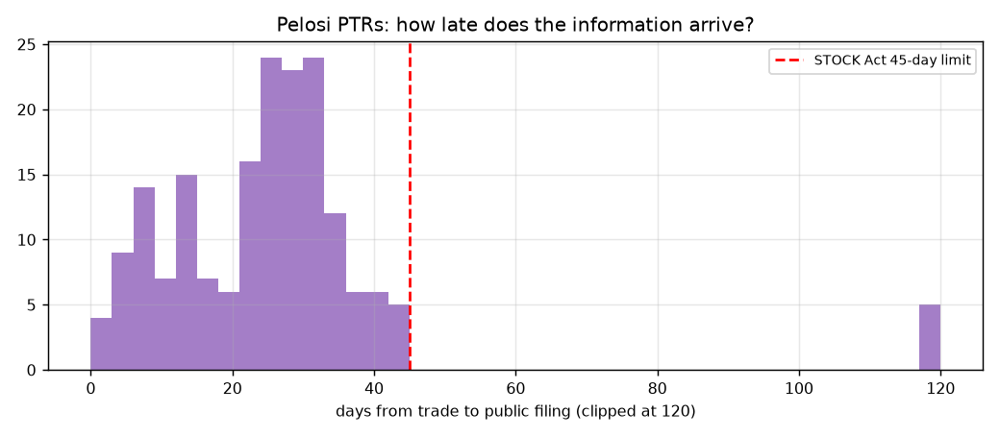

§6 quantifies what the lag costs: the same rules applied on the (unknowable) trade date are shown in red as a
lookahead reference only.

## 2. Data

| Leg | Source | Span | Rows |
|---|---|---|---|
| Long: Nancy Pelosi PTRs | House Clerk financial-disclosure index + PTR PDFs (parsed with `pdfplumber`) | 2015-01-12 → 2026-08-21 | 183 transactions (113 buys incl. 93 call purchases/exercises, 67 sells) across 35 tickers |
| Short: Jim Cramer bullish calls | Kull (2026) transcript-derived *Mad Money* signals, CC-BY-4.0 | 2018-01-02 → 2024-12-31 | 16,701 calls (11,794 new buys, 4,907 holds) across 1,386 tickers |
| Cross-check | TheStreet *Mad Money* screener scrape (offline since 2022) | 2020-01-03 → 2022-06-15 | 6,488 bullish calls |
| Prices | Yahoo Finance (Pelosi names, benchmarks, ^IRX) + FIGI-keyed adjusted closes shipped with Kull (2026) for the Cramer universe, incl. delisted names | 2014-06 → 2026-09 | 1,397 series |

*Cramer source agreement:* 58.3% of transcript calls appear in the screener within ±1 day,
and 53.9% of screener bullish calls appear in the transcript data. The two were built
independently (LLM transcript extraction vs. TheStreet's editorial log), so partial overlap is expected; the
transcript data is used because it is longer and includes the segment/confidence metadata.

**Why the joint window is 2018-01 → 2024-12.** Pelosi PTRs are available electronically from Jan-2015 and continue
to today; machine-readable Cramer calls exist from Jan-2018 to Dec-2024. A long/short book needs both legs, so the
headline results cover **7 years, 2018-01-02 → 2024-12-31**. The Pelosi leg alone is also reported over 2015 → 2026
(§7). Pre-2015 PTRs exist only as scanned paper filings and are excluded as unreliable.

Known gaps: `WORK` (Slack, acquired 2021) and old-Hertz (`HTZ`, 2015 options) have no Yahoo history, and `BFET` is
private — these Pelosi positions are dropped. The Cramer universe is survivorship-bias free (1,385/1,386 tickers priced).

Leg population by year (default parameters):

| year | pct_days_long_populated | pct_days_short_populated | avg_n_long | avg_n_short |
|---|---|---|---|---|
| 2018 | 97.6% | 99.6% | 2.5 | 111 |
| 2019 | 100.0% | 100.0% | 4.7 | 113 |
| 2020 | 100.0% | 100.0% | 5.8 | 121 |
| 2021 | 100.0% | 100.0% | 10.5 | 110 |
| 2022 | 100.0% | 100.0% | 10.1 | 100 |
| 2023 | 100.0% | 100.0% | 2.7 | 109 |
| 2024 | 100.0% | 100.0% | 3.3 | 112 |

## 3. Strategy rules

* **Long leg (Pelosi):** every disclosed purchase of stock, exercised call, or purchased call option on a listed
  ticker opens/extends an equal-weighted long (max 20% per name) for up to
  `pelosi_hold_days` sessions; a disclosed sale of that ticker closes it the session after the sale is filed.
* **Short leg (Cramer):** every new bullish call (`start_long`) opens an equal-weighted short held
  `cramer_hold_days` sessions; repeated calls on the same name extend the position.
* **Notionals:** 100% long / 100% short of NAV when both legs are populated (the long leg is often under-invested
  because Pelosi holds few names and the cap binds).
* **Beta neutrality:** trailing `beta_window`-day betas of each leg to SPY (shrunk toward 1) give the ex-ante net beta;
  an SPY overlay brings it to 0 every day. Target is 0; the mandate is |β| ≤ ±0.10.

Pre-specified ("prior") parameters, fixed before looking at any result:
`pelosi_hold_days=252`, `cramer_hold_days=21`,
`beta_window=126`.

## 4. Headline results — full joint window (pre-specified parameters, 2018-01 → 2024-12)

| Metric | Value |
|---|---|
| Period | 2018-01-02 → 2024-12-31 (6.99 y) |
| Total return | 56.2% |
| CAGR | 6.59% |
| Annualised vol | 13.66% |
| Sharpe (vs T-bill) | 0.37 |
| Sortino | 0.54 |
| Max drawdown | -29.6% (537 days) |
| Calmar | 0.22 |
| Daily hit rate | 50.7% |
| Skew / kurtosis | 0.12 / 1.4 |
| Worst / best day | -4.06% / 4.27% |
| Rolling 1y |beta| to SPY: max / % within ±0.10 | 0.20 / 82% |

**Beta neutrality check:** full-sample beta to SPY = 0.009 (s.e. 0.023); realised
rolling 1-year beta stayed within ±0.10 on **82%** of days
(max |β| = 0.20). Beta to the Russell 2000 = -0.121, to QQQ = 0.124.

### Versus equity benchmarks

| Benchmark | Bench CAGR | Bench Sharpe | Bench MaxDD | Strategy − Bench CAGR | Beta (s.e.) | Alpha ann. (t) | Corr | Info ratio |
|---|---|---|---|---|---|---|---|---|
| SPY (S&P 500) | 13.74% | 0.64 | -33.7% | -7.15% | 0.009 (0.023) | +4.91% (0.91) | 0.01 | -0.32 |
| IWM (Russell 2000) | 6.82% | 0.30 | -41.1% | -0.22% | -0.121 (0.015) | +5.92% (1.16) | -0.22 | -0.08 |
| QQQ (Nasdaq 100) | 19.34% | 0.76 | -35.1% | -12.75% | 0.124 (0.023) | +2.74% (0.51) | 0.22 | -0.53 |
| DIA (Dow Jones Industrial) | 10.22% | 0.48 | -36.7% | -3.63% | -0.084 (0.019) | +5.80% (1.11) | -0.12 | -0.17 |
| RSP (S&P 500 Equal Weight) | 10.13% | 0.47 | -39.0% | -3.54% | -0.132 (0.019) | +6.26% (1.23) | -0.20 | -0.17 |
| VTI (US Total Market) | 13.12% | 0.60 | -35.0% | -6.53% | -0.011 (0.022) | +5.16% (0.96) | -0.02 | -0.29 |

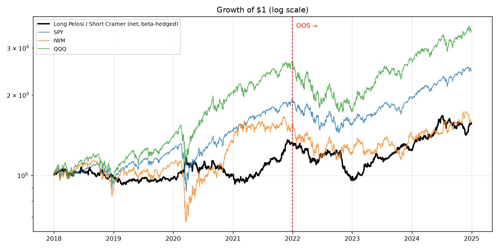
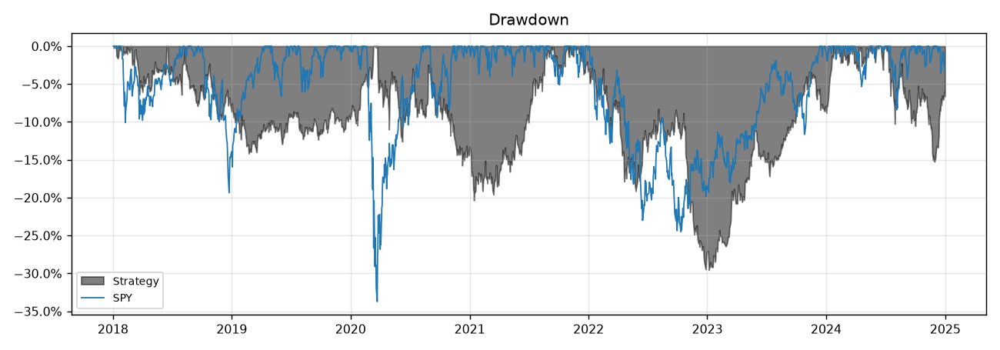
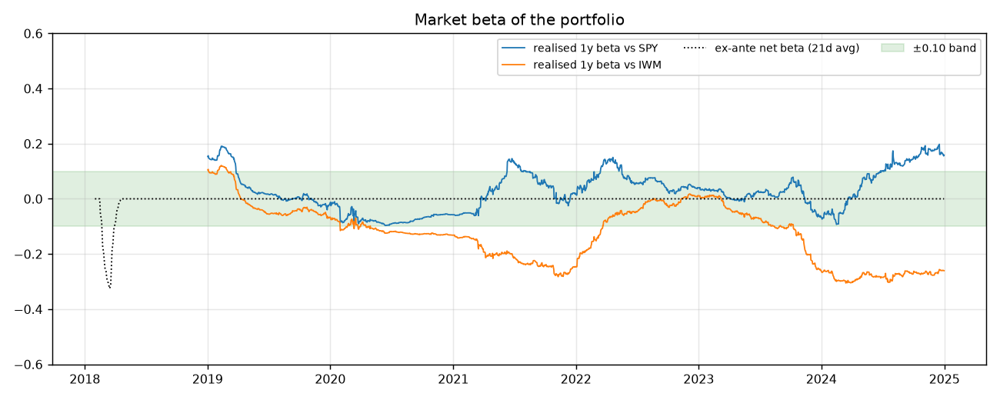
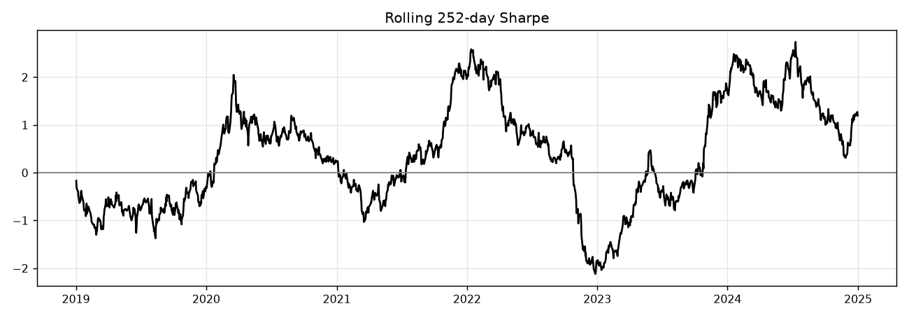

### Calendar-year returns

| year | strategy | SPY | IWM | QQQ |
|---|---|---|---|---|
| 2018 | -1.8% | -4.6% | -11.1% | -0.1% |
| 2019 | -1.1% | 31.2% | 25.4% | 39.0% |
| 2020 | 4.0% | 18.3% | 20.0% | 48.4% |
| 2021 | 29.9% | 28.7% | 14.5% | 27.4% |
| 2022 | -24.8% | -18.2% | -20.5% | -32.6% |
| 2023 | 26.6% | 26.2% | 16.8% | 54.9% |
| 2024 | 24.9% | 24.9% | 11.4% | 25.6% |

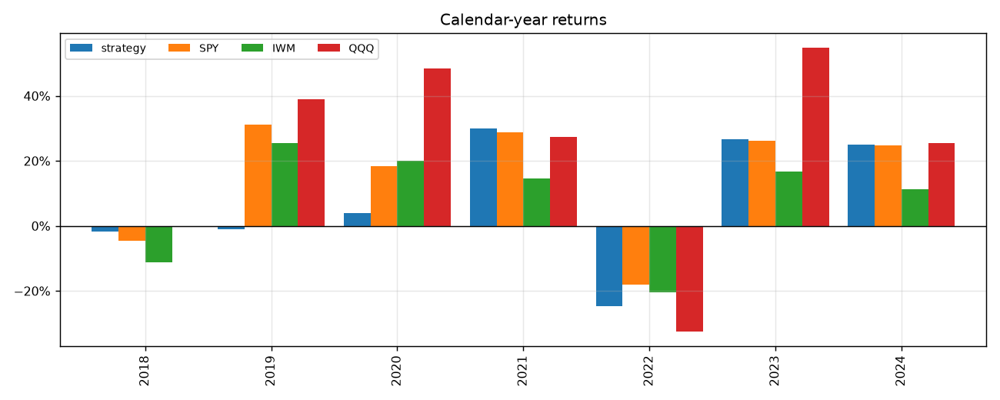

### Where does the P&L come from? (each book beta-hedged on its own)

| book | CAGR | Vol | Sharpe | MaxDD | Beta vs SPY | Alpha ann. | Alpha t |
|---|---|---|---|---|---|---|---|
| L/S net (default) | 6.6% | 13.7% | 0.37 | -29.6% | 0.01 | 4.9% | 0.91 |
| Long Pelosi only (hedged) | 5.3% | 12.8% | 0.29 | -33.0% | 0.02 | 3.4% | 0.72 |
| Short Cramer only (hedged) | 3.0% | 8.4% | 0.12 | -33.7% | -0.01 | 1.1% | 0.32 |
| L/S unhedged (no SPY overlay) | 3.4% | 15.4% | 0.15 | -32.4% | -0.11 | 3.6% | 0.59 |
| L/S before costs & borrow | 11.6% | 13.7% | 0.71 | -25.6% | 0.01 | 9.5% | 1.77 |
| Long Pelosi only (hedged), before costs | 6.1% | 12.8% | 0.35 | -32.2% | 0.02 | 4.3% | 0.88 |
| Short Cramer only (hedged), before costs & borrow | 7.3% | 8.4% | 0.61 | -31.2% | -0.01 | 5.2% | 1.51 |

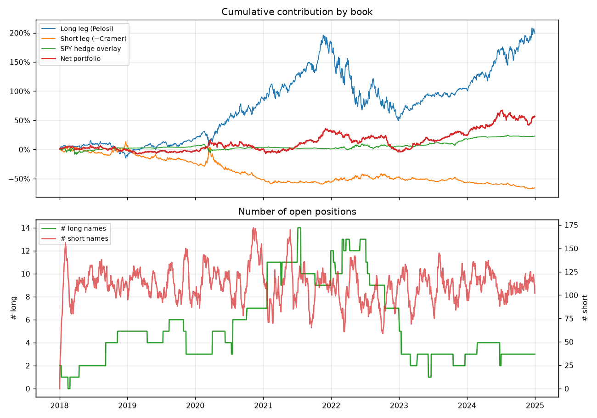

## 5. In-sample vs out-of-sample

Split: **IS = 2018-01-01 → 2021-12-31**, **OOS = 2022-01-01 → 2024-12-31**. The parameter grid
(pelosi_hold_days∈[63, 126, 252, 504] × cramer_hold_days∈[5, 21, 63, 126] × beta_window∈[63, 126, 252], 48 combinations) was searched on IS Sharpe only.

| metric | Pre-specified params · IS | Pre-specified params · OOS | IS-optimised params · IS | IS-optimised params · OOS | Walk-forward (yearly re-selection) · OOS only |
|---|---|---|---|---|---|
| start | 2018-01-02 | 2022-01-03 | 2018-01-02 | 2022-01-03 | 2020-01-02 |
| end | 2021-12-31 | 2024-12-31 | 2021-12-31 | 2024-12-31 | 2024-12-31 |
| cagr | 7.0% | 6.0% | 8.5% | 6.2% | 6.2% |
| ann_vol | 13.0% | 14.5% | 13.4% | 14.7% | 16.1% |
| sharpe | 0.50 | 0.21 | 0.59 | 0.22 | 0.30 |
| sortino | 0.76 | 0.29 | 0.88 | 0.31 | 0.44 |
| max_drawdown | -20.4% | -27.5% | -20.7% | -27.8% | -36.1% |
| SPY_beta | -0.01 | 0.04 | -0.04 | 0.05 | -0.03 |
| SPY_alpha_ann | 6.7% | 2.7% | 8.6% | 2.9% | 5.2% |
| SPY_alpha_t | 1.02 | 0.30 | 1.31 | 0.32 | 0.70 |
| SPY_excess_cagr | -10.5% | -2.9% | -9.0% | -2.7% | -8.3% |
| IWM_excess_cagr | -4.2% | 4.9% | -2.8% | 5.0% | -1.1% |
| QQQ_excess_cagr | -20.2% | -3.5% | -18.8% | -3.3% | -13.8% |

* IS-optimised parameters: `{'pelosi_hold_days': 252, 'cramer_hold_days': 63, 'beta_window': 252}`.
* Spearman rank correlation between IS and OOS Sharpe across the 48 grid points: **0.39**
  (near zero or negative ⇒ in-sample ranking has no predictive value; the "best IS" point is then just noise).
* Walk-forward: parameters re-selected each January from all prior years (first OOS year 2020); the stitched
  OOS series has Sharpe **0.30**, CAGR 6.2%, max DD -36.1%.

Top-10 grid points by IS Sharpe:

| pelosi_hold_days | cramer_hold_days | beta_window | is_sharpe | oos_sharpe | is_cagr | oos_cagr | oos_max_dd | is_mean_abs_beta |
|---|---|---|---|---|---|---|---|---|
| 252 | 63 | 252 | 0.593 | 0.217 | 0.085 | 0.062 | -0.278 | 0.007 |
| 252 | 126 | 252 | 0.575 | 0.273 | 0.085 | 0.071 | -0.268 | 0.007 |
| 252 | 63 | 63 | 0.575 | 0.316 | 0.082 | 0.078 | -0.256 | 0.000 |
| 252 | 63 | 126 | 0.560 | 0.245 | 0.080 | 0.066 | -0.266 | 0.006 |
| 252 | 126 | 63 | 0.553 | 0.373 | 0.081 | 0.087 | -0.249 | 0.000 |
| 252 | 21 | 252 | 0.548 | 0.165 | 0.077 | 0.054 | -0.286 | 0.005 |
| 252 | 126 | 126 | 0.540 | 0.302 | 0.079 | 0.076 | -0.257 | 0.006 |
| 504 | 63 | 252 | 0.538 | 0.029 | 0.083 | 0.034 | -0.283 | 0.002 |
| 252 | 21 | 63 | 0.524 | 0.271 | 0.073 | 0.070 | -0.266 | 0.000 |
| 504 | 126 | 252 | 0.523 | 0.091 | 0.083 | 0.043 | -0.273 | 0.002 |

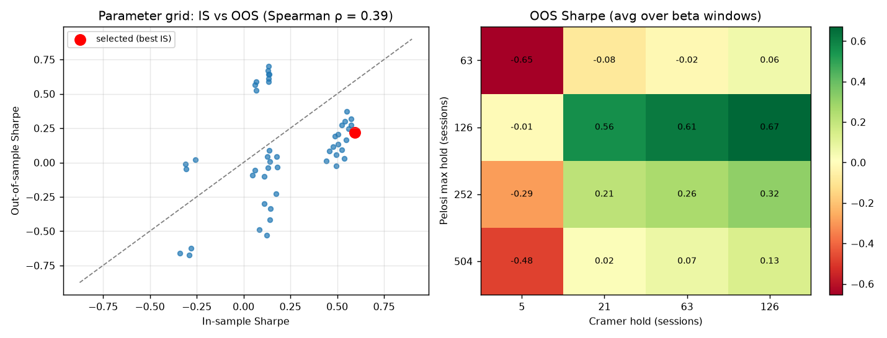
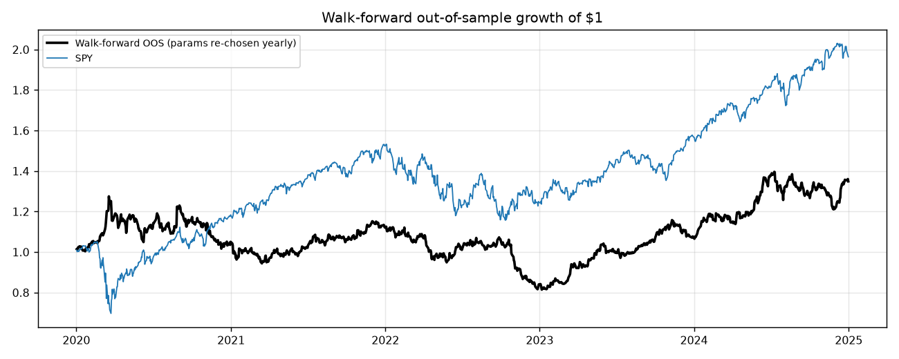

Walk-forward selections:

| year | pelosi_hold_days | cramer_hold_days | beta_window | train_sharpe | oos_year_return | oos_year_sharpe |
|---|---|---|---|---|---|---|
| 2020 | 504 | 126 | 252 | 0.767 | 0.050 | 0.321 |
| 2021 | 504 | 126 | 252 | 0.580 | 0.067 | 0.524 |
| 2022 | 252 | 63 | 252 | 0.690 | -0.250 | -1.892 |
| 2023 | 252 | 126 | 63 | 0.286 | 0.282 | 1.661 |
| 2024 | 252 | 63 | 63 | 0.448 | 0.252 | 1.197 |

## 6. Cost of the disclosure lag, rule sensitivity and placebo tests

### Disclosure lag

| variant | sharpe | cagr | max_dd | long_leg_sharpe | long_leg_cagr |
|---|---|---|---|---|---|
| trade date (LOOKAHEAD - not implementable) | 0.22 | 4.5% | -34.2% | 0.13 | 3.2% |
| filing date + 1 session (baseline) | 0.37 | 6.6% | -29.6% | 0.29 | 5.3% |
| filing date + 5 sessions | 0.45 | 7.8% | -29.6% | 0.36 | 6.3% |
| filing date + 21 sessions | 0.48 | 8.2% | -29.7% | 0.40 | 6.7% |
| filing date + 45 sessions | 0.44 | 7.8% | -28.9% | 0.38 | 6.6% |

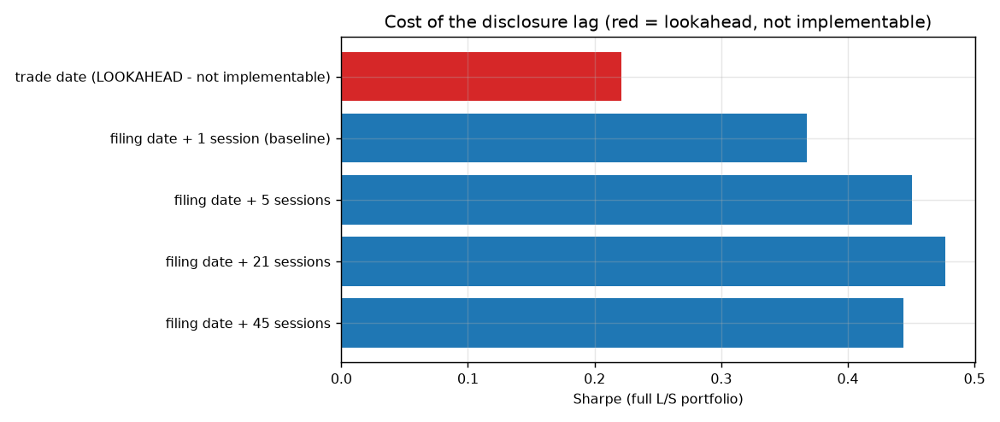

### Modelling-choice sensitivity (one change at a time from the pre-specified baseline, full joint window)

| variant | sharpe | cagr | max_dd | spy_beta | alpha_ann | alpha_t | avg_n_long | avg_n_short |
|---|---|---|---|---|---|---|---|---|
| baseline | 0.37 | 6.6% | -29.6% | 0.01 | 4.9% | 0.91 | 5.5 | 111 |
| Cramer: fade new buys AND reiterated holds | 0.39 | 6.9% | -30.4% | 0.01 | 5.2% | 0.98 | 5.5 | 141 |
| Cramer: only high-confidence calls (≥0.9) | 0.32 | 5.8% | -27.8% | 0.03 | 3.9% | 0.75 | 5.5 | 66 |
| Pelosi: ignore option trades (stock only) | 0.07 | 2.4% | -29.6% | 0.01 | 0.7% | 0.15 | 2.9 | 111 |
| Pelosi: weight by disclosed $ range midpoint | 0.28 | 5.4% | -28.2% | 0.01 | 3.8% | 0.71 | 5.5 | 111 |
| Pelosi: no per-name cap (100%) | 0.49 | 10.1% | -30.4% | -0.01 | 9.1% | 1.28 | 5.5 | 111 |
| Pelosi: do not close on disclosed sales | 0.55 | 9.6% | -27.5% | 0.01 | 7.8% | 1.36 | 6.2 | 111 |
| Beta: leg-return-series method | 0.37 | 6.7% | -28.3% | 0.03 | 4.7% | 0.87 | 5.5 | 111 |
| Hedge instrument: QQQ instead of SPY | 0.61 | 10.5% | -25.7% | 0.00 | 8.7% | 1.54 | 5.5 | 111 |
| Costs doubled (20 bp, 200 bp borrow) | 0.03 | 1.8% | -33.3% | 0.01 | 0.3% | 0.05 | 5.5 | 111 |
| No costs, no borrow | 0.71 | 11.6% | -25.6% | 0.01 | 9.5% | 1.77 | 5.5 | 111 |

### Placebos (200 trials each; p = share of placebo Sharpes ≥ actual 0.37)

| Placebo | What it breaks | p-value |
|---|---|---|
| Pelosi filings time-shifted ±6–24 months | timing of her trades (keeps the names) | 0.440 |
| Pelosi tickers → random large caps | her stock selection (keeps the dates) | 0.260 |
| Cramer tickers → random universe names | his stock selection (keeps the dates and counts) | 0.000 |
| Cramer tickers shuffled across dates | his *timing* only (keeps exactly his names and how often he mentions them) | 0.000 |

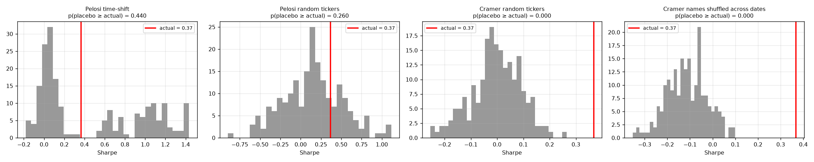

### Bootstrap (stationary block bootstrap, 21-day blocks)

| Sample | Sharpe | 95% CI | P(Sharpe ≤ 0) |
|---|---|---|---|
| Full joint window | 0.37 | [-0.43, 1.14] | 0.204 |
| OOS only | 0.21 | [-1.02, 1.58] | 0.361 |

## 7. Pelosi leg over its full history (2015-01 → 2026-09, no Cramer leg)

| | Beta-hedged (SPY overlay) | Unhedged long-only |
|---|---|---|
| CAGR | 4.7% | 17.4% |
| Vol | 12.7% | 22.5% |
| Sharpe | 0.26 | 0.74 |
| Max drawdown | -33.0% | -50.1% |
| Beta vs SPY | 0.02 | 0.94 |
| Alpha vs SPY (ann., t) | +3.1% (0.81) | +4.6% (1.01) |
| SPY CAGR same period | 14.0% | 14.0% |
| QQQ CAGR same period | 19.2% | 19.2% |

## 8. Caveats

* **Option leverage is not modelled.** Pelosi's most publicised trades are deep-in-the-money LEAPS. A disclosed call
  purchase is treated as a *delta-one long in the underlying* with equal weight; replicating the option payoff would
  require strike/expiry-level pricing that is not available point-in-time from PTRs (only ranges are disclosed).
* **Dollar sizes are ranges** ($1,001–$15,000 … $5m–$25m); equal weighting is the default, amount-weighting is an
  option (`pelosi_weighting="amount"`).
* **Short-leg frictions are simplified**: a flat borrow fee, no hard-to-borrow constraints, no short-sale
  restrictions. Small-cap Cramer names would in practice be more expensive or impossible to borrow.
* **Concentration.** The long leg frequently holds fewer than 5 names; the beta hedge neutralises market risk but
  not idiosyncratic risk (NVDA/AAPL dominate).
* **Sample size.** 7 joint years and ~113 long entries is a small sample; every inference above should be read with
  the bootstrap CIs and placebo p-values, not the point estimates.
